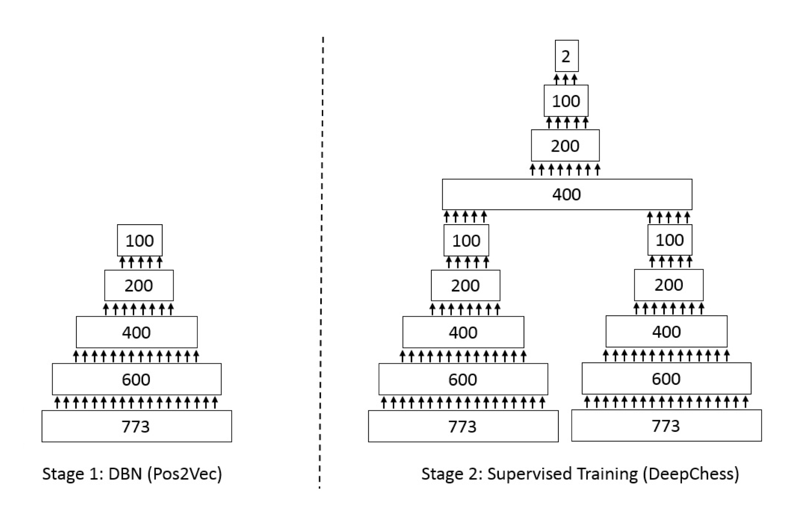
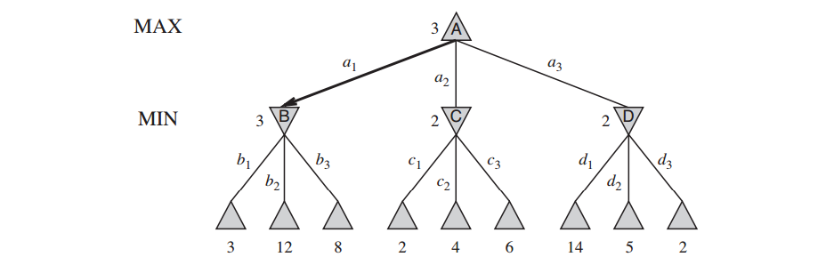
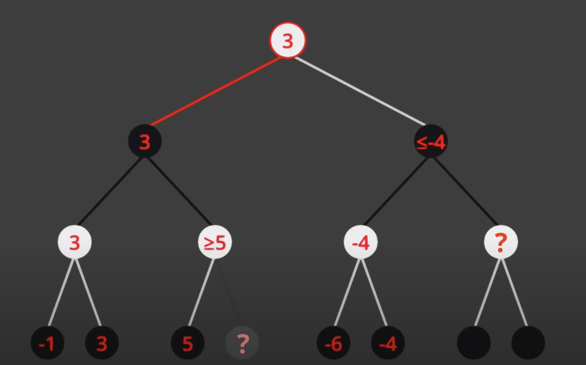
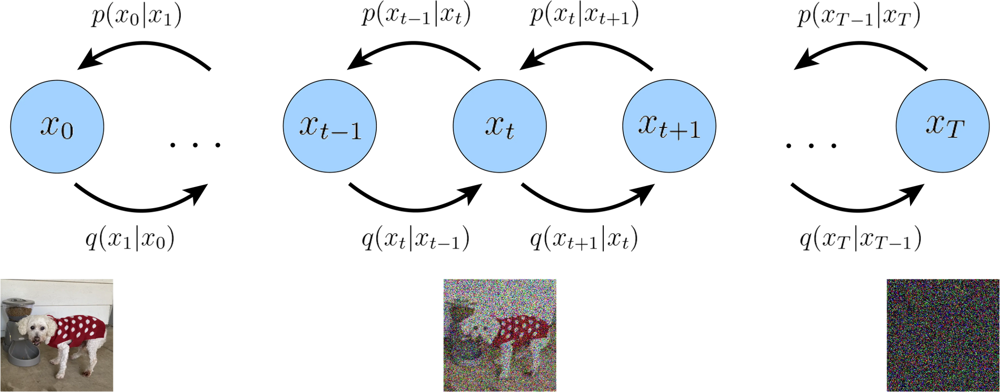
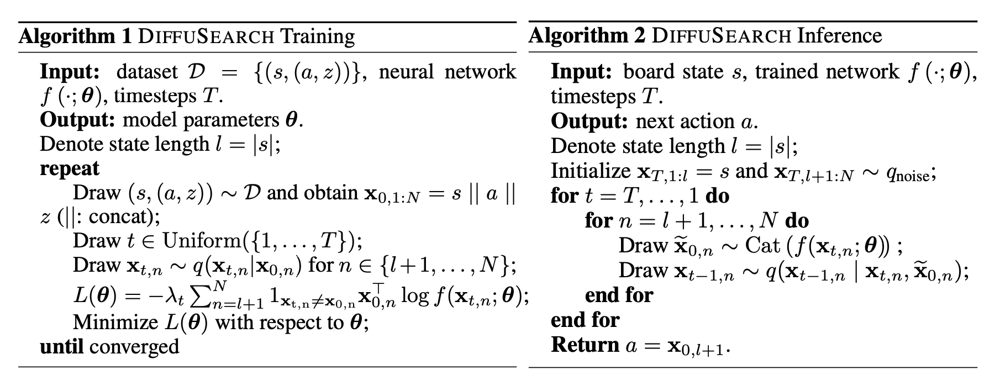

# Methodlogy
## 1. Autoencoder + Siamese Network

### DeepChess Score Estimator
- Autoencoder: This embedding the state board into a lower-dimensional space.
    - Encoder: maps the input to a lower-dimensional latent space
    - Decoder: maps the latent space back to the original input space
- Siamese Network: This learned to compare two input mapping it to end score
    - The network takes two inputs: the current state and the next state
    - The network outputs a score 

### Minimax Search 
- Minimax Search: This is a search algorithm that is used to find the best move in a game. 
    - The algorithm works by recursively exploring the game tree and evaluating the possible moves at each level.
    - The algorithm assumes that both players play optimally, and it tries to minimize the maximum loss for the player.
- We use the score which be outputted from the DeepChess Score Estimator as the evaluation function for the Minimax Search.

<div style="page-break-after: always;"></div>


```peudo
function minimax(position, depth, maximizingPlayer)
    if depth == 0 or game over in position
        return static evaluation of position

    if maximizingPlayer
        maxEval = -infinity
        for each child of position
            eval = minimax(child, depth - 1, false)
            maxEval = max(maxEval, eval)
        return maxEval

    else
        minEval = +infinity
        for each child of position
            eval = minimax(child, depth - 1, true)
            minEval = min(minEval, eval)
        return minEval

// initial call
minimax(currentPosition, 3, true)
```

<div style="page-break-after: always;"></div>

#### Minimax Search with Alpha-Beta Pruning
- Speed up the Minimax Search by eliminating branches that do not need to be explored.

```peudo
function minimax(position, depth, alpha, beta, maximizingPlayer)
    if depth == 0 or game over in position
        return static evaluation of position

    if maximizingPlayer
        maxEval = -infinity
        for each child of position
            eval = minimax(child, depth - 1, alpha, beta, false)
            maxEval = max(maxEval, eval)
            alpha = max(alpha, eval)
            if beta <= alpha
                break   // beta cutoff
        return maxEval

    else
        minEval = +infinity
        for each child of position
            eval = minimax(child, depth - 1, alpha, beta, true)
            minEval = min(minEval, eval)
            beta = min(beta, eval)
            if beta <= alpha
                break   // alpha cutoff
        return minEval

```

<div style="page-break-after: always;"></div>

## 2. Heuristic Search 

| Component                       | Description                                                        | Purpose                                                   |
| ------------------------------- | ------------------------------------------------------------------ | --------------------------------------------------------- |
| **1. Material Score**           | Fixed value per piece (e.g., pawn = 100, knight = 320)             | Measure of piece count advantage                          |
| **2. Piece-Square Table (PST)** | Bonus/penalty per piece depending on its square location           | Encourage good piece positioning                          |
| **3. Game Phase Score**         | Interpolation factor (0 to 1) based on remaining material          | Adjust importance of features between opening and endgame |
| **4. Pawn Structure Score**     | Includes:                                                          |                                                           |
| - Isolated Pawn Penalty         | - Penalty if no adjacent same-color pawns                          | Penalize weak, undefended pawns                           |
| - Passed Pawn Bonus             | - Bonus for pawns with no enemy pawn in front or adjacent          | Encourage promotion potential                             |
| **5. Bishop Pair Bonus**        | Bonus if player owns both bishops                                  | Recognize strength in open positions                      |
| **6. Rook on Open File**        | Bonus if rook is on a file with no pawns                           | Encourage control of open files                           |
| **7. Mobility Score**           | Difference in number of legal moves between players                | Favor active positions, punish cramped setups             |
| **8. Interpolation Score**      | Weighted average of opening/endgame scores using game phase factor | Make the evaluation responsive to game stage              |

$\implies$ Also use Minimax Search with Alpha-Beta Pruning to choose the best move for board state.

<div style="page-break-after: always;"></div>

## 3. Deep Q-Learning

### **Core Components**

#### **a) ChessQNetwork**

- **What**: A convolutional neural network (CNN) with 3 convolutional blocks and a dense head.
- **Key Features**:
  - **Input**: 903 features (8x8 board encoding + game state metadata + action features).
  - **Architecture**:
    - `Conv2d(14,128) → BatchNorm → ReLU` (×3 conv layers)
    - `Linear(512*8*8+9 → 1024 → 1)` (dense layers)
  - **Purpose**: Predicts Q-values for (board state, move) pairs.

#### **b) PrioritizedReplayBuffer**

- **What**: Experience replay with priority sampling.
- **Key Mechanics**:
  - **Priority**: Samples transitions with TD-error-based importance.
  - **Annealing**: Uses `alpha=0.6` (priority exponent), `beta=0.4` (importance sampling).
  - **Stability**: Clips priorities to avoid extremes (`np.clip(priorities, 1e-5, None)`).

#### **c) Board Encoding**

- **What**: Converts chess boards to 903D vectors.
- **Structure**:
  - **Piece channels**: 14-layer 8x8 tensor (6 piece types × 2 colors + 2 empty).
  - **Metadata**: Castling rights, turn, check, move count.

#### **d) Reward Function**

- **Components**:
  - Material gain/loss  
  - Center control  
  - King safety  
  - Mobility penalty  
  - Repetition penalty  
- **Design Choice**: Combines handcrafted heuristics with learned values.

---

### **Training Pipeline**

#### **a) Self-Play Generation**

- **Process**:  
  1. Uses ε-greedy exploration (`EPSILON_START=1.0 → EPSILON_END=0.1`).
  2. Augments data with board rotations/flips.
  3. Applies final reward based on game outcome.

#### **b) Network Update**

- **Key Steps**:  
  1. Samples prioritized transitions from buffer.
  2. Computes Q-values using **online network**.
  3. Computes target Q-values using **target network** (synced every `SYNC_INTERVAL=200`).
  4. Updates priorities based on TD errors.

#### **c) Loss & Optimization**

- **Loss**: Prioritized MSE loss (`(weights * (Q - target_Q)^2`).
- **Optimizer**: AdamW with learning rate `LR=1e-5`, gradient clipping (`clip_grad_norm=1.0`).

---

<div style="page-break-after: always;"></div>

### **Hyperparameters**

| Parameter          | Value     | Purpose                               |
|--------------------|-----------|---------------------------------------|
| `BATCH_SIZE`       | 512       | Batch size for training               |
| `BUFFER_SIZE`      | 100,000   | Experience replay capacity            |
| `GAMMA`            | 0.999     | Discount factor for future rewards    |
| `SYNC_INTERVAL`    | 200       | Target network sync frequency         |
| `EPSILON_DECAY`    | 0.99999   | Exploration rate decay (per episode)  |

---

### **Key Interactions**

#### **a) QNet ↔ Environment**

- **Flow**:
  `Board → encode_board() → QNet → Q-values → ε-greedy action → New state`

#### **b) Experience Replay ↔ Training**

- **Loop**:
  1. Self-play games → Buffer (with priorities).
  2. Sample batch → Compute loss → Update QNet.
  3. Adjust priorities → Repeat.

#### **c) Target Network Stabilization**

- **Why**: Avoids "chasing moving targets" in Q-value estimation.
- **How**: Delayed sync (`SYNC_INTERVAL`) of target network weights.

---

### **Evaluation Challenge**

#### **Stockfish Integration Issue**

- **Symptoms**: Fails to load Stockfish engine (path/library issues).
- **Impact**: Cannot benchmark AI against a strong baseline.
- **Workaround**:
  - Temporarily uses self-play win rates (`evaluate_model()` fallback).
  - Requires fixing engine path/OS compatibility for proper evaluation.

---

### **Architecture Diagram**  

```txt
[Self-Play]  
   │  
   ▼  
[Prioritized Buffer] → Sampled Batch → [QNet] ←→ [Target Net]  
   ▲                      │               │  
   └──Priority Update─────┘               │  
                                   [Optimizer (AdamW)]  
```

---

### **Notable Design Choices**

1. **Action Encoding**: Normalizes move squares (`from_square/63`, `to_square/63`).
2. **Board Augmentation**: Random rotations/flips for data diversity.
3. **Delayed Rewards**: Adds game outcome reward to all transitions in an episode.

<div style="page-break-after: always;"></div>

## 4. Discrete Diffusion Model + ASA 
#### Problem Settings
- We describe Chess game as a Markov Process (Which is a type of Markov Decision Process - Given the current state, the next state is independent of the previous states)
    - State Space ($\mathcal S$): The state of the board 
    - Action Space ($\mathcal A$): The set of all possible moves
    - State transition function ($\mathcal f(s, a)$): The function that takes a state and an action and returns the next state
    - Action Probability Distribution ($\mathcal p(a|s)$): The probability of taking action $a$ in state $s$
    - $o_i = 1 || -1$: terminal reward at time $i$ (win/loss)
    - Value function ($v^p(s)$): The expected return when both player play with the same strategy $p$
    $$
    v^p(s) = \mathbb E 
    \begin{bmatrix}
    o_i | s_i = s, a_{i...I} \sim p
    \end{bmatrix}
    $$

$\implies$ Our target is maximize the value function $v^p(s)$ for my engine. Then to do that we need to find the best action $a^*$ in state $s$. 

In other words, we need to find the best policy $\pi^*$ that maximizes the value function $v^p(s)$. $\implies$ Learning the best probability distribution $\pi^*(a|s)$ for each state $s$.

#### Discrete Diffusion Model
- Diffusion Models are a class of generative model which consist 2 processes: forward and reverse processes. Both processes are Markov chains. 
    - The forward process is a Markov chain that gradually adds noise to the data,  
    - The reverse process is a Markov chain that gradually removes noise from the data.

- Suppose we want to learn a target sample $x_0 \sim q(x_0)$, $x_0$ is a discrete random variable with $K$ possible values. Defining the forward and backward processes as follows:
    - **Forward process**: gradually adds noise to the data
    $$
    q(x_{1:T} | x_{0}) = \prod_{t=1}^T q(x_t | x_{t-1})
    $$
    - **Reverse process**: gradually removes noise from the data
    $$
    p_\theta(x_{0:T}) = p(x_T) \prod_{t=1}^T p_\theta(x_{t-1} | x_t)
    $$

<div style="page-break-after: always;"></div>


- We propose the target function for conditioning the forward process on the action $a$:
$$
K(q_\psi(\cdot | x), p_\theta(\cdot, x)) = \int_{-\infty}^{\infty} q_\psi(z|x)\log(\frac{q_\psi(z | x)}{p_\theta(z | x)})\\
\mathcal{L}= \mathbb{E}_{q_\psi(\cdot | x)}
\begin{bmatrix}
\log{
\begin{pmatrix}
\frac{p_\theta(x, Z)}{q_\psi(Z | x)}
\end{pmatrix}
} 
\end{bmatrix} 
\\ \implies 

\begin{aligned}
\log p_\theta (x) 
&= \int_{-\infty}^{\infty}q(\cdot | x) \log(p_\theta(x)) dz
\\
&= \int_{-\infty}^{\infty}q_\psi(\cdot | x)\log (\frac{p_\theta(x, Z)}{q_\psi (z | x)})dz 
+  
\int_{-\infty}^{\infty} q_\psi(z|x)\log(\frac{q_\psi(z | x)}{p_\theta(z | x)})dz \\

&= \mathcal{L} + K(q_\psi(\cdot | x), p_\theta(\cdot, x)) \\ 

&\ge \mathcal{L} \\ 
\implies \mathcal L &\ge -\log p_\theta (x) 
\end{aligned}
$$
$\implies$ We call L as ELBO (Evidence Lower Bound) 

When $q(\cdot | x)$ close $p_\theta(\cdot | x)$, then ELBO simiar to \log p_\theta(x) 
$\implies \mathcal L$ is an upper bound on the negative log-likelihood

$\implies$ Minimizing this upper bound  $\mathcal L$ brings us closer to minimizing the true negative log-likelihood.

$\implies$ We got the general type of loss function
$$
\mathcal L_{vb} = -\log p_\theta (x)  + K(q_\psi(\cdot | x), p_\theta(\cdot, x))
$$ 

$\implies$ We can use above loss for muiltiple steps: 

$$
\begin{equation}
\mathcal
L_{{vb}} = \mathbb{E}_{q(x_0)} \Bigg[
\underbrace{D_{\text{KL}}[q(x_T|x_0)\,\|\,p(x_T)]}_{L_T}
+ \underbrace{\sum_{t=2}^{T} \mathbb{E}_{q(x_t|x_0)} \left[
D_{\text{KL}}[q(x_{t-1}|x_t, x_0)\,\|\,p_\theta(x_{t-1}|x_t)]
\right]}_{L_{t-1}}
- \underbrace{\mathbb{E}_{q(x_1|x_0)}[\log p_\theta(x_0|x_1)]}_{L_0}
\Bigg]
\end{equation}
$$

- We could simplified the above loss function by using the following equation:
$$
K(q(x_{t-1}|x_t, x_0) \|p_\theta(x_{t-1}|x_t)) = -\lambda _t1_{x_t\ne x_o}x_0^T\log f(x_t, \theta) \\ 

\implies L_{vb} = -\mathbb E_{q(x_0)}\left[ \sum_{t=1}^{T}\lambda_t \mathbb E_{q(x_t|x_0)}1_{x_t\ne x_o}x_0^T\log f(x_t, \theta)\right]
$$

- $\lambda_t = \frac{\alpha_{t-1} -\alpha_{t}}{1-\alpha_t}$: time-dependent reweighting term that assigns lower weight for
noisier $x_t$ 
- $\alpha_t \in [0, 1]$: predefined noise scheduler

<div style="page-break-after: always;"></div>

#### ASA - Action/State/Action
- Our probability distribution is a function of the state and action. 
$$
p_{\theta}(a_i, s_{i + 1}, a_{i + 1}, ..., s_{i+h-1}. a_{i+h-1} |s_i)
$$

#### Training 
- Data: use the output of the stockfish engine as the training data.
$$
\mathcal D = \{(s_i, (a_i^{SF}, s_{i+1}, ..., a_{i+h-1}^{SF}))\}
$$
#### Inference 
$$
\argmax p_\theta(a_i, s_{i + 1}, a_{i + 1}, ..., s_{i+h-1}, a_{i+h-1} |s_i)
$$

